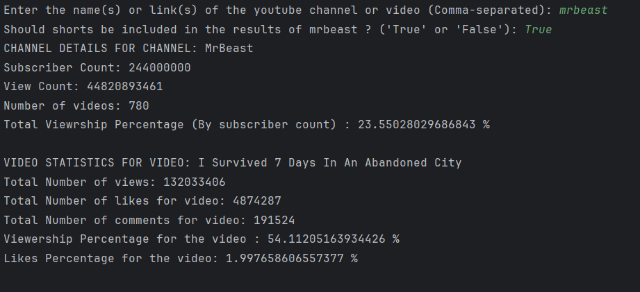

# YOUTUBE DATA AGGREGATOR

## Introduction:

This code is capable of taking a YouTube username or channel link or video link as input and present data about the
channel or the video.
Things such as subscriber count, video info, engagement metrics, viewership percentage and other info.

## Installation:
1. ##### Installation process:
    This code can be  installed by directly cloning the GIT repository using GIT Bash into a local directory.
    This can be acheived using the following command:

       git clone https://github.com/SaiKarthik-1/youtube_data_api.git_

2. #### Software Dependencies:
    
    This code requires python to be installed in the local machine and also 'requests' module for API calls.
    The requests module can be installed by using the following command (if python is already installed):
        
        pip install requests

3. #### API References:

    We make use of YouTube data API v3 in the code.
    We can call this API using a API key, which can be generated for free in Google Developers console.
    You can view the documentation at:

        https://developers.google.com/youtube/v3/getting-started

## Running the code:

After all the installation steps are complete, you can run the code using by directly running the main file in the code.

The code takes a comma separated input which can contain YouTube channel name, channel link or a video link.
The code can process multiple inputs at once.

The output of the code may look like this:

